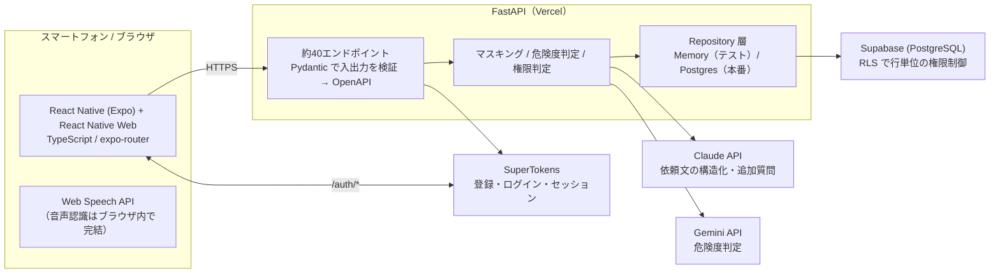

# fitt0（フィット）

> あなたと地域が、ピタッとハマる。
> 高齢者の「業者を呼ぶほどではない困りごと」と、学生の「誰かを助けたい」を、近所・単発・30分単位でつなぐ地域たすけあいサービス。

ハッカソン **Tornado 2026** チームD「んすんす」の作品です（旧名 TeToTe）。

- 本番: https://hackathon-tau-mauve.vercel.app （スマートフォン向け。PC は F12 → スマートフォン表示）
- プレゼン動画（5分）: https://youtu.be/nB_QOWTI4G8

## なぜ作ったか

- 高齢者の **51.0%** に日常生活の困りごとがあり（買い物・庭の手入れ・ゴミ出し）、**44.4%** は身内や友人を頼れない（板橋区 介護保険ニーズ調査 / 内閣府 令和5年度調査）。
- 学生の **57.5%** は「ボランティアに参加したい」のに、実績にできた学生は **2.5%**（日本財団ボランティアセンター 2023）。
- 私たち自身が **45自治体にアンケート**を送り、14件（約30%）の回答を得た。多くの自治体が「些細な困りごとは最重要ではないが解決したい」「既存の地域アプリでは十分ではない」と答えた。横須賀市は「町内会へ紹介する」と明言。

「最重要ではないから役所では後回し」「既存アプリでは不十分」。その空白を埋めるのが fitt0 です。

## 主要機能

| 依頼する側（高齢者） | 支援する側（学生） |
|---|---|
| **話すだけで依頼**（ブラウザ標準の音声認識）。AI が足りない情報を1問だけ聞き返す | 近所の依頼を一覧・詳細で確認し、理由を書いて応募 |
| 電話番号や住所は **送る前に自動で伏せる**。本人が確認してから公開 | 依頼者に選ばれるとトークが開く（3秒ポーリングの疑似リアルタイム） |
| 依頼の **危険度を AI とルールで判定**。危険な作業は受け付けず、判断が難しいものは審査へ | 連絡先を送ろうとすると警告。通報・ブロック・学生証による本人確認 |
| 応募者を選び、マッチ成立。完了は双方が確認 | 完了した支援で **キャラクターが育ち**、AI が実績を文章にまとめる（「実際に行動した証明」） |
| 応募者の **公開プロフィール**（本人確認・回数・評価の要約）を見てから選べる | **実績プロフィール公開ページ** で自分の見え方を確認できる |
| **プッシュ通知** と **お知らせ一覧** で、応募・選出・メッセージを見逃さない | 予定日を過ぎた依頼は自動で募集終了（毎日の定期処理） |

共通: 登録前に **練習モード**（依頼者編・支援者編）で一通り体験できる。**PWA**（ホーム画面に追加、オフラインでも殻が開く）。**アカウント削除**（進行中の支援があれば断る）。**パスワード再設定**。利用規約・プライバシーポリシー・ヘルプ。
運営: **自治体ダッシュボード**（期間別の依頼数・完了率・地域別・カテゴリ別、CSV 出力、少人数は伏せる）、**通報の確認**（対応済み・利用停止）、管理者の自動付与。

デザインは 1画面1操作、文字サイズ3段階。ブランドカラーはオレンジ `#eca12c` × グリーン `#1f853b`。名前は fit（ぴったり合う）+ to + 0（ゼロから始まるコミュニティ）。

## アーキテクチャ



個人情報（電話番号・住所など）は入力の瞬間に伏せ、**AI に渡す文・ログ・URL に生の値を残さない**設計です。

## 技術スタック

| 層 | 技術 |
|---|---|
| フロントエンド | React Native / Expo (expo-router), React Native Web, TypeScript, supertokens-web-js, Vitest |
| バックエンド | Python 3.12, FastAPI, Pydantic, asyncpg, supertokens-python, pytest |
| データ | Supabase (PostgreSQL, RLS, forward-only migration) |
| 認証 | SuperTokens（Email/Password、ヘッダー方式のセッション） |
| AI | Claude API（構造化・追加質問）, Gemini API（危険度判定）, Web Speech API（音声入力） |
| インフラ | Vercel（フロント・API）, GitHub Actions（CI） |

## ディレクトリ構成

```
app/                 FastAPI アプリ
  cruds/main.py      エンドポイント定義
  schemas/           Pydantic モデル（API 契約）
  services/          業務ロジック（安全判定・構造化・キャラクター進捗 など）
  repositories/      Memory / Postgres の永続化実装
  auth.py            SuperTokens 連携・CurrentUser
tetote/              Expo アプリ
  src/app/           画面（help = 依頼者側, helper = 支援者側, auth, onboarding）
  src/features/      API クライアントと画面ロジック（画面から切り離してテスト）
  src/api/           共通 HTTP クライアント・型
  src/voice/         音声入力の状態遷移とマスキング
supabase/            マイグレーション・DB テスト
tests/               バックエンドテスト（pytest）
docs/                API 契約（openapi.json）、設計メモ、調整事項、提出前チェックリスト
scripts/             OpenAPI 書き出しなど
```

## ローカルで動かす

前提: Python 3.12（`uv` 推奨）、Node.js 20 以上。

```bash
# バックエンド（認証をモックにして起動）
uv venv --python 3.12 .venv
uv pip install --python .venv/bin/python -e ".[dev]"
SUPERTOKENS_ENABLED=false AUTH_MOCK_ENABLED=true MOCK_RESET_ENABLED=true \
REQUEST_REPOSITORY=memory WEBSITE_DOMAIN=http://localhost:8081 \
.venv/bin/python -m uvicorn app.main:app --reload --port 8000
# Swagger UI: http://localhost:8000/docs
```

```bash
# フロントエンド
cd tetote
npm ci
EXPO_PUBLIC_API_URL=http://localhost:8000 npx expo start --web
```

Windows の場合は `.venv/Scripts/python.exe` を使ってください。`AUTH_MOCK_ENABLED=true` のときは `X-Mock-User-Id` ヘッダーで利用者を切り替えられます（既定 `usr_101`）。

## テスト

```bash
# バックエンド（実 API キーが環境にあっても外部へは出ない）
.venv/bin/python -m pytest -q
# API 契約の同期確認
.venv/bin/python scripts/export_openapi.py && git diff --exit-code docs/openapi.json

# フロントエンド
cd tetote && npx tsc --noEmit && npm test
```

自動テストは 500 件超（バックエンド約260、フロントエンド約280）。PR ごとに GitHub Actions で pytest・vitest・型チェック・OpenAPI 同期・Web ビルドを実行します。

## 主要な環境変数（本番）

| 変数 | 用途 |
|---|---|
| `APP_ENV=production` | 本番モード。`AUTH_MOCK_ENABLED` / `MOCK_RESET_ENABLED` が有効なら起動を拒否 |
| `REQUEST_REPOSITORY=postgres`, `DATABASE_URL` | Supabase への接続 |
| `SUPERTOKENS_ENABLED=true`, `SUPERTOKENS_CONNECTION_URI`, `SUPERTOKENS_API_KEY` | 認証 |
| `WEBSITE_DOMAIN`, `API_DOMAIN`, `AUTH_COOKIE_SAME_SITE` | フロントのオリジン（CORS）と Cookie 設定 |
| `CRON_SECRET` | 定期処理（期限切れの確定）を呼ぶための合言葉。Vercel Cron が自動で付ける。未設定なら定期処理は無効 |
| `VAPID_PUBLIC_KEY`, `VAPID_PRIVATE_KEY`, `VAPID_SUBJECT` | Web Push（プッシュ通知）の鍵と連絡先。未設定なら通知機能は静かに無効 |
| `ADMIN_AUTH_SUBJECTS` | 管理者にする SuperTokens ユーザーID（カンマ区切り）。ログイン時に `role=admin` へ。自治体ダッシュボードなどの管理者機能に必要 |
| `ANTHROPIC_API_KEY`, `GEMINI_API_KEY` | AI（未設定ならルールのみで動作） |
| `EXPO_PUBLIC_API_URL`（フロント） | API の URL。未設定・http・localhost だとビルドを止める |

提出前の確認手順は [docs/submission-checklist.md](docs/submission-checklist.md) を参照。

自分のアカウントで Supabase / SuperTokens / Vercel を用意する手順は [docs/infra-setup.md](docs/infra-setup.md)、
DB への migration 適用は `scripts/apply_migrations.py` を使う。

## ドキュメント

- [docs/api-development.md](docs/api-development.md) — API 開発ガイドと実装状況
- [docs/openapi.json](docs/openapi.json) — API 契約（自動生成）
- [docs/risk-assessment.md](docs/risk-assessment.md) — 危険度判定の方針
- [docs/voice-input.md](docs/voice-input.md) — 音声入力の状態遷移
- [docs/request-publish-flow.md](docs/request-publish-flow.md) — 依頼の公開・取消の状態遷移
- [docs/safety-reporting.md](docs/safety-reporting.md) — 通報・ブロック
- [docs/account-deletion.md](docs/account-deletion.md) — アカウント削除（退会）の方針と処理順
- [docs/municipality-dashboard.md](docs/municipality-dashboard.md) — 自治体ダッシュボード（集計の方針と段階計画）
- [docs/pwa.md](docs/pwa.md) — PWA 対応（ホーム画面に追加・オフラインの殻・確認方法）
- [docs/push-notifications.md](docs/push-notifications.md) — プッシュ通知（鍵の作り方・何をいつ送るか・確認方法）
- [docs/request-expiry.md](docs/request-expiry.md) — 古い依頼の自動期限切れ（期限の決め方・定期処理）
- [docs/operations.md](docs/operations.md) — 運用手順（通報の確認、利用停止、本番の動作確認 `scripts/smoke_production.py`）
- [docs/cross-team-coordination.md](docs/cross-team-coordination.md) — フロント・DB 担当との調整事項
- [docs/infra-setup.md](docs/infra-setup.md) — 自前インフラ（Supabase / SuperTokens / Vercel）の構築手順
- [dbtodo.md](dbtodo.md) — Supabase 永続化の進捗
- [AGENTS.md](AGENTS.md) — 開発ルール（PR 単位・OpenAPI 同期・レビュー）

## チーム「んすんす」

| 名前 | 役割 |
|---|---|
| 永井 晃太朗 ([@kotakota914](https://github.com/kotakota914)) | PM / 発表資料 / フロント・バックエンド |
| 佐々木 初 ([@Ui-Sasaki](https://github.com/Ui-Sasaki)) | リポジトリ管理 / UI |
| 柳 雅楽 ([@masa-yo-shi](https://github.com/masa-yo-shi)) | バックエンド / DB / デプロイ |
| 尾宮 健斗 | バックエンド（個人情報保護） |
| 田中 来海 | UI/UX・キャラクターデザイン |
| グエン・トアンキエト | エンジニア |

## 今後

- 本人確認画像・プロフィール画像の Storage 管理（Supabase Storage）。未設定のあいだは「準備中」表示
- 大学メール確認の送信サービス設定（Cloudflare Email）
- 自治体ロール（市区町村ごとに自分の地域だけを見る）
- iOS / Android アプリ化とネイティブのプッシュ通知
